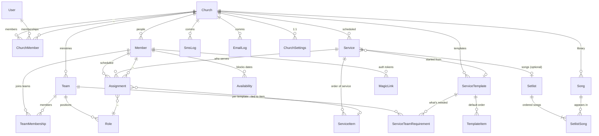

# SundayPlan — Domain Model

## Bounded contexts

1. **Identity** — Users, churches, memberships, magic-links
2. **Roster** — Members, teams, roles, skill levels, availability
3. **Planning** — Service templates, services, items, songs, setlists
4. **Scheduling** — Assignments, scoring/auto-fill, swap marketplace
5. **Communications** — SMS, email, push, templates, quotas, logs
6. **Reporting** — Volunteer balance, license usage (CCLI + TONO), service coverage

## Multi-tenancy

- **Tenant root:** `Church`. Every domain table carries `church_id`.
- **Row-Level Security (RLS):** `church_id IN (SELECT church_id FROM church_member WHERE user_id = auth.uid())`.
- **Service role bypasses RLS** — used only by Edge Functions.
- **Magic-link volunteers** use a separate JWT claim `volunteer_member_id` scoping to their own assignments only.

## ERD



## Entity reference

### Church
| Column | Type | Notes |
|--------|------|-------|
| `id` | UUID PK | |
| `name` | TEXT | |
| `slug` | TEXT UNIQUE | URL-safe, for `/r/{slug}/...` magic links |
| `plan_tier` | TEXT | `free`, `starter`, `growth`, `network` |
| `locale` | TEXT | `no`, `en`, ... |
| `timezone` | TEXT | IANA, e.g. `Europe/Oslo` |
| `denomination` | TEXT | for TONO routing default |
| `created_at`, `updated_at` | TIMESTAMPTZ | |

### ChurchSettings (1:1 with Church)
| Column | Type | Notes |
|--------|------|-------|
| `church_id` | UUID PK FK | |
| `ccli_license_number` | TEXT | |
| `ccli_size_category` | TEXT | `A`–`F` |
| `ccli_streaming_addon` | BOOL | |
| `tono_license_status` | TEXT | `none` / `state_church_blanket` / `direct_agreement` / `application_pending` / `not_applicable` |
| `tono_customer_id` | TEXT | |
| `tono_streaming_addon` | BOOL | |
| `default_max_assignments_per_month` | INT | rotation fairness |
| `reminder_cadence` | JSONB | when to send reminders |
| `sms_quota_used` | INT | reset monthly via cron |
| `sms_quota_used_at_reset` | TIMESTAMPTZ | |
| `auto_buy_sms_overage` | BOOL | |
| `sundaystage_connected` | BOOL | |
| `sundayrec_connected` | BOOL | |
| `sundaysong_connected` | BOOL | |

### User (Supabase auth.users + a thin profile)
Supabase auth is the source of truth for users. We extend with a `user_profile` table:
| Column | Type | Notes |
|--------|------|-------|
| `id` | UUID PK FK → auth.users.id | |
| `display_name` | TEXT | |
| `avatar_url` | TEXT | |
| `locale_preference` | TEXT | |

### ChurchMember (user ↔ church)
| Column | Type | Notes |
|--------|------|-------|
| `church_id` | UUID FK | composite PK |
| `user_id` | UUID FK | composite PK |
| `role` | TEXT | `admin`, `planner`, `team_lead`, `viewer` |
| `created_at` | TIMESTAMPTZ | |

### Member (a person in a church's roster — may or may not have a User account)
| Column | Type | Notes |
|--------|------|-------|
| `id` | UUID PK | |
| `church_id` | UUID FK | |
| `display_name` | TEXT | |
| `phone_e164` | TEXT | preferred contact — SMS is core |
| `email` | TEXT | |
| `user_id` | UUID FK → auth.users | nullable; set when they create an account |
| `language` | TEXT | for templated messages |
| `preferred_channel` | TEXT | `sms`, `email`, `push` |
| `birthday` | DATE | optional |
| `joined_at` | DATE | |
| `status` | TEXT | `active`, `inactive`, `archived` |
| `notes` | TEXT | planner-only |
| `tags` | TEXT[] | |
| `target_serves_per_month` | INT | rotation fairness target |
| `created_at`, `updated_at`, `archived_at` | TIMESTAMPTZ | |

### Team
| Column | Type | Notes |
|--------|------|-------|
| `id` | UUID PK | |
| `church_id` | UUID FK | |
| `name` | TEXT | "Worship", "Sound", "Kids", "Hospitality" |
| `color` | TEXT | hex for calendar |
| `description` | TEXT | |
| `created_at`, `updated_at` | TIMESTAMPTZ | |

### Role (a position within a Team)
| Column | Type | Notes |
|--------|------|-------|
| `id` | UUID PK | |
| `team_id` | UUID FK | |
| `name` | TEXT | "Drummer", "Lead Vocal", "Sound Engineer" |
| `description` | TEXT | |

### TeamMembership (member ↔ team, with role + skill)
| Column | Type | Notes |
|--------|------|-------|
| `member_id` | UUID FK | composite PK |
| `team_id` | UUID FK | composite PK |
| `role_id` | UUID FK | composite PK |
| `skill_level` | TEXT | `training` / `capable` / `lead` / `trainer` |
| `notes` | TEXT | |

### Availability (member can't serve)
| Column | Type | Notes |
|--------|------|-------|
| `id` | UUID PK | |
| `member_id` | UUID FK | |
| `kind` | TEXT | `recurring` / `range` / `specific` |
| `pattern` | JSONB | e.g. `{ "weekday": "wednesday" }` or `{ "from": "2026-06-15", "to": "2026-06-30" }` |
| `reason` | TEXT | optional, default visibility = planner-only |
| `created_at` | TIMESTAMPTZ | |

### ServiceTemplate (recurring shape)
| Column | Type | Notes |
|--------|------|-------|
| `id` | UUID PK | |
| `church_id` | UUID FK | |
| `name` | TEXT | "Standard Sunday Morning" |
| `default_duration_min` | INT | |

### TemplateItem (default sections in a template)
| Column | Type | Notes |
|--------|------|-------|
| `template_id` | UUID FK | composite PK |
| `position` | INT | composite PK |
| `label` | TEXT | "Welcome", "Worship", "Sermon" |
| `kind` | TEXT | `welcome`, `worship_set`, `scripture`, `sermon`, `response`, `closing` |
| `duration_min` | INT | |

### ServiceTeamRequirement (default roles needed per template)
| Column | Type | Notes |
|--------|------|-------|
| `template_id` | UUID FK | composite PK |
| `role_id` | UUID FK | composite PK |
| `quantity` | INT DEFAULT 1 | "2 vocalists" |

### Service (concrete instance)
| Column | Type | Notes |
|--------|------|-------|
| `id` | UUID PK | |
| `church_id` | UUID FK | |
| `template_id` | UUID FK | nullable |
| `name` | TEXT | "Sunday 14 Sept 2026" |
| `starts_at_utc` | TIMESTAMPTZ | |
| `starts_at_local` | TIMESTAMPTZ GENERATED | from `starts_at_utc` + church timezone |
| `notes` | TEXT | |
| `state` | TEXT | `draft`, `published`, `in_progress`, `played`, `archived` |
| `created_at`, `updated_at` | TIMESTAMPTZ | |

### ServiceItem (ordered item within a Service)
| Column | Type | Notes |
|--------|------|-------|
| `id` | UUID PK | |
| `service_id` | UUID FK | |
| `position` | INT | unique per service |
| `label` | TEXT | display name |
| `kind` | TEXT | `welcome`, `song`, `scripture`, `sermon`, `announcement`, `gap` |
| `duration_min` | INT | |
| `notes` | TEXT | |
| `song_id` | UUID FK | nullable |
| `scripture_ref` | TEXT | "John 3:16" |

### Setlist (the worship songs in order — denormalized for convenience)
| Column | Type | Notes |
|--------|------|-------|
| `id` | UUID PK | |
| `service_id` | UUID FK UNIQUE | one per service |
| `key` | JSONB | per-song key overrides |
| `created_at`, `updated_at` | TIMESTAMPTZ | |

### SetlistSong
| Column | Type | Notes |
|--------|------|-------|
| `setlist_id` | UUID FK | composite PK |
| `position` | INT | composite PK |
| `song_id` | UUID FK | |
| `key_override` | TEXT | |
| `notes` | TEXT | |

### Song (mirror of SundaySong canonical when synced)
| Column | Type | Notes |
|--------|------|-------|
| `id` | UUID PK | |
| `church_id` | UUID FK | |
| `title` | TEXT | |
| `author` | TEXT | |
| `ccli_song_id` | TEXT | |
| `tono_work_id` | TEXT | |
| `default_key` | TEXT | |
| `tempo_bpm` | INT | |
| `language` | TEXT | |
| `themes` | TEXT[] | |
| `last_used_at` | TIMESTAMPTZ | denormalized — for rotation scoring |
| `sundaysong_id` | UUID | nullable; canonical id when synced |
| `chord_chart_url` | TEXT | |
| `demo_url` | TEXT | |
| `created_at`, `updated_at` | TIMESTAMPTZ | |

### Assignment (member ↔ role for a specific service)
| Column | Type | Notes |
|--------|------|-------|
| `id` | UUID PK | |
| `church_id` | UUID FK | denormalized for RLS efficiency |
| `service_id` | UUID FK | |
| `role_id` | UUID FK | |
| `member_id` | UUID FK | |
| `service_item_id` | UUID FK | nullable — pinned to a specific item |
| `status` | TEXT | `pending`, `invited`, `accepted`, `declined`, `no_response`, `removed` |
| `score` | NUMERIC | from auto-fill scoring engine (audit) |
| `score_breakdown` | JSONB | for explainability |
| `invited_at` | TIMESTAMPTZ | |
| `responded_at` | TIMESTAMPTZ | |
| `created_by` | TEXT | `planner` / `auto_fill` / `swap` |

### MagicLink (volunteer auth tokens)
| Column | Type | Notes |
|--------|------|-------|
| `id` | UUID PK | |
| `member_id` | UUID FK | |
| `purpose` | TEXT | `assignment_response`, `availability_set`, `swap_request` |
| `assignment_id` | UUID FK | nullable |
| `token_hash` | TEXT | sha-256 of the signed JWT we send |
| `single_use` | BOOL DEFAULT TRUE | |
| `used_at` | TIMESTAMPTZ | nullable |
| `expires_at` | TIMESTAMPTZ | |
| `created_at` | TIMESTAMPTZ | |

### SmsLog, EmailLog
Every comm is logged for audit + quota accounting.

| Column | Type | Notes |
|--------|------|-------|
| `id` | UUID PK | |
| `church_id` | UUID FK | |
| `member_id` | UUID FK | nullable |
| `provider` | TEXT | `twilio`, `linkmobility`, `resend`, `postmark` |
| `template_id` | TEXT | |
| `to_recipient` | TEXT | normalized number or email |
| `body` | TEXT | rendered (for audit/debug; consider hashing for GDPR) |
| `status` | TEXT | `queued`, `sent`, `delivered`, `failed`, `bounced` |
| `cost_cents` | INT | estimated |
| `sent_at` | TIMESTAMPTZ | |
| `provider_message_id` | TEXT | |

## Five hardest queries

### Q1: "Who's available + skilled for sound on Sept 14 that hasn't served the last 3 weeks?"
```sql
SELECT m.*
FROM member m
JOIN team_membership tm USING (member_id)
WHERE tm.team_id   = :sound_team_id
  AND tm.skill_level IN ('capable', 'lead', 'trainer')
  AND m.status    = 'active'
  AND NOT EXISTS (
    SELECT 1 FROM availability av
    WHERE av.member_id = m.id
      AND availability_covers(av, :service_date)
  )
  AND COALESCE((
    SELECT MAX(s.starts_at_utc)
    FROM assignment a JOIN service s ON s.id = a.service_id
    WHERE a.member_id = m.id AND a.status = 'accepted'
  ), '-infinity') < :service_date - INTERVAL '21 days';
```

`availability_covers(av, date)` is a SQL function checking against the
`pattern` JSONB. Indexed by `(member_id)`.

### Q2: "Coverage status of every assignment for next 4 Sundays"
Materialized view `service_coverage` summarizes fill rates per service. Refreshed on `assignment` change via trigger.

### Q3: "Send all pending reminders due in the next 15 minutes"
```sql
SELECT a.*
FROM assignment a
WHERE a.status IN ('invited','accepted')
  AND a.next_reminder_at <= now() + INTERVAL '15 min'
  AND a.next_reminder_at >  now() - INTERVAL '15 min'  -- exclude already-due
ORDER BY a.next_reminder_at;
```

`next_reminder_at` computed on insert/state-change via business logic in
Edge Function. Indexed.

### Q4: "TONO licensing usage report for Q2"
```sql
SELECT s.title, s.tono_work_id, sl.position, srv.starts_at_local, srv.was_streamed_flag
FROM service srv
JOIN service_item si ON si.service_id = srv.id
JOIN song s ON s.id = si.song_id
WHERE srv.church_id = :church_id
  AND srv.starts_at_local BETWEEN :from AND :to
  AND srv.state = 'played'
  AND s.tono_work_id IS NOT NULL;
```

`was_streamed_flag` set on service when SundayRec reported it was streaming. Critical for TONO's "streaming separate" royalty pool.

### Q5: "Onboarding funnel — minutes from first member added to first SMS delivered"
For metrics dashboard. Combines `church.created_at`, first `member` row, first delivered `sms_log.status = 'delivered'`.

## Decisions

- **Single Supabase project**, multi-tenant via RLS. Schema-per-tenant rejected: explosion in migration overhead.
- **Phone is the most valuable field** on `member`. Always prompt for it. SMS magic link is the whole UX.
- **TONO + CCLI both first-class.** Norwegian frikirker have to deal with both. We are the only suite that doesn't make TONO a CSV export afterthought.
- **`Member.user_id` is nullable.** Volunteers never need to create an account. The magic-link flow handles RSVP without auth.
- **Soft delete via `archived_at`.** Service history must outlive an archived member.

## Phase status (May 2026)

- [x] Phase 0.1 — Monorepo + Turborepo
- [x] Phase 0.4 — Design tokens shared (web + mobile)
- [x] Phase 1.1 — Domain model (this document)
- [ ] Phase 1.2 — Supabase migrations + RLS
- [x] Phase 1.3 — Auth — magic-link JWT core (`@sundayplan/auth`, 11 tests) + `0003` volunteer RLS + issue/respond Edge Functions (verified e2e) + planner auth (`@supabase/ssr`, `(app)`/`(auth)` route groups, email sign-in/up, middleware gating, sign-out) + **onboarding** (create-church server action via service-role since `church` has no INSERT policy; membership gate redirects new users to `/onboarding`). Verified at the data layer: create church+membership → user reads it under RLS, anon sees `[]`. OAuth providers + join-via-invite deferred
- [~] Phase 2 — Web admin — 2.1 shell + 2.2 people + 2.3 teams built (`apps/web`: App Router, Tailwind v4 on shared tokens, /design guide). **Persistence landed:** People + Teams + Schedule read live Supabase data via `lib/data/*` under the planner's RLS (cookie-bound server client); **People CRUD** (add/edit/archive) and **Teams CRUD** (create/edit) via server actions validated with shared Zod schemas. Remaining: role + team-membership management (assign members to roles), bulk import, filters. (Dashboard still runs the SDK engines on `lib/mock.ts` crafted data by design.)
- [ ] Phase 3 — Service planning + setlist
- [~] Phase 4 — Schedule view + conflict detection — 4.1 schedule grid on **live data** (`apps/web/app/(app)/schedule` via `lib/data/schedule.ts`: roles × services with status pills, per-service coverage, and `detectConflicts()` run over real assignments — e.g. a member below a role's `skill_required` surfaces as a genuine skill_gap; migration `0004_role_skill` added that column) + 4.2 conflict-rule engine (`packages/sdk/src/conflicts.ts`, 7 of 9 rules + 19 Vitest tests; rules 5 family & 9 key-person deferred pending schema additions). **Assignment CRUD landed:** the grid's cells are interactive — assign a member from the eligible pool (trained for the role) or remove, via server actions (upsert/delete under assignment_planner_all RLS); conflicts re-run on every edit. Service-level role requirements not modelled yet → unfilled-slot rule dormant; role qty>1 per cell + 4.3 settings pending
- [~] Phase 5 — AI auto-fill — 5.1 scoring engine (`scoring.ts`, 25 tests) + 5.2 orchestrator core (`autofill.ts` — deterministic fill with tiebreaker, double-book prevention, unfilled reasons; 9 tests) done; 5.2 UX + 5.3 NL tweaks pending
- [ ] Phase 6 — Communications infra (SMS, email, push)
- [ ] Phase 7 — Magic-link volunteer response
- [ ] Phase 8 — Native mobile app
- [ ] Phase 9 — AI service planning
- [ ] Phase 10 — Sunday-suite integration
- [ ] Phase 11 — Reports (incl. TONO + CCLI)
- [ ] Phase 12 — Launch
