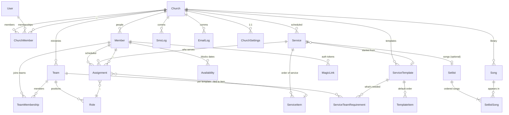

# SundayPlan — Domain Model

## Bounded contexts

1. **Identity** — Users, churches, memberships, magic-links
2. **Roster** — Members, teams, roles, skill levels, availability
3. **Planning** — Service templates, services, items, songs, setlists
4. **Scheduling** — Assignments, scoring/auto-fill, swap marketplace
5. **Communications** — SMS, email, push, templates, quotas, logs
6. **Reporting** — Volunteer balance, license usage (CCLI + TONO), service coverage

## Multi-tenancy

- **Tenant root:** `Church`. Every domain table carries `church_id`.
- **Row-Level Security (RLS):** `church_id IN (SELECT church_id FROM church_member WHERE user_id = auth.uid())`.
- **Service role bypasses RLS** — used only by Edge Functions.
- **Magic-link volunteers** use a separate JWT claim `volunteer_member_id` scoping to their own assignments only.

## ERD



## Entity reference

### Church
| Column | Type | Notes |
|--------|------|-------|
| `id` | UUID PK | |
| `name` | TEXT | |
| `slug` | TEXT UNIQUE | URL-safe, for `/r/{slug}/...` magic links |
| `plan_tier` | TEXT | `free`, `starter`, `growth`, `network` |
| `locale` | TEXT | `no`, `en`, ... |
| `timezone` | TEXT | IANA, e.g. `Europe/Oslo` |
| `denomination` | TEXT | for TONO routing default |
| `created_at`, `updated_at` | TIMESTAMPTZ | |

### ChurchSettings (1:1 with Church)
| Column | Type | Notes |
|--------|------|-------|
| `church_id` | UUID PK FK | |
| `ccli_license_number` | TEXT | |
| `ccli_size_category` | TEXT | `A`–`F` |
| `ccli_streaming_addon` | BOOL | |
| `tono_license_status` | TEXT | `none` / `state_church_blanket` / `direct_agreement` / `application_pending` / `not_applicable` |
| `tono_customer_id` | TEXT | |
| `tono_streaming_addon` | BOOL | |
| `default_max_assignments_per_month` | INT | rotation fairness |
| `reminder_cadence` | JSONB | when to send reminders |
| `sms_quota_used` | INT | reset monthly via cron |
| `sms_quota_used_at_reset` | TIMESTAMPTZ | |
| `auto_buy_sms_overage` | BOOL | |
| `sundaystage_connected` | BOOL | |
| `sundayrec_connected` | BOOL | |
| `sundaysong_connected` | BOOL | |

### User (Supabase auth.users + a thin profile)
Supabase auth is the source of truth for users. We extend with a `user_profile` table:
| Column | Type | Notes |
|--------|------|-------|
| `id` | UUID PK FK → auth.users.id | |
| `display_name` | TEXT | |
| `avatar_url` | TEXT | |
| `locale_preference` | TEXT | |

### ChurchMember (user ↔ church)
| Column | Type | Notes |
|--------|------|-------|
| `church_id` | UUID FK | composite PK |
| `user_id` | UUID FK | composite PK |
| `role` | TEXT | `admin`, `planner`, `team_lead`, `viewer` |
| `created_at` | TIMESTAMPTZ | |

### Member (a person in a church's roster — may or may not have a User account)
| Column | Type | Notes |
|--------|------|-------|
| `id` | UUID PK | |
| `church_id` | UUID FK | |
| `display_name` | TEXT | |
| `phone_e164` | TEXT | preferred contact — SMS is core |
| `email` | TEXT | |
| `user_id` | UUID FK → auth.users | nullable; set when they create an account |
| `language` | TEXT | for templated messages |
| `preferred_channel` | TEXT | `sms`, `email`, `push` |
| `birthday` | DATE | optional |
| `joined_at` | DATE | |
| `status` | TEXT | `active`, `inactive`, `archived` |
| `notes` | TEXT | planner-only |
| `tags` | TEXT[] | |
| `target_serves_per_month` | INT | rotation fairness target |
| `created_at`, `updated_at`, `archived_at` | TIMESTAMPTZ | |

### Team
| Column | Type | Notes |
|--------|------|-------|
| `id` | UUID PK | |
| `church_id` | UUID FK | |
| `name` | TEXT | "Worship", "Sound", "Kids", "Hospitality" |
| `color` | TEXT | hex for calendar |
| `description` | TEXT | |
| `created_at`, `updated_at` | TIMESTAMPTZ | |

### Role (a position within a Team)
| Column | Type | Notes |
|--------|------|-------|
| `id` | UUID PK | |
| `team_id` | UUID FK | |
| `name` | TEXT | "Drummer", "Lead Vocal", "Sound Engineer" |
| `description` | TEXT | |

### TeamMembership (member ↔ team, with role + skill)
| Column | Type | Notes |
|--------|------|-------|
| `member_id` | UUID FK | composite PK |
| `team_id` | UUID FK | composite PK |
| `role_id` | UUID FK | composite PK |
| `skill_level` | TEXT | `training` / `capable` / `lead` / `trainer` |
| `notes` | TEXT | |

### Availability (member can't serve)
| Column | Type | Notes |
|--------|------|-------|
| `id` | UUID PK | |
| `member_id` | UUID FK | |
| `kind` | TEXT | `recurring` / `range` / `specific` |
| `pattern` | JSONB | e.g. `{ "weekday": "wednesday" }` or `{ "from": "2026-06-15", "to": "2026-06-30" }` |
| `reason` | TEXT | optional, default visibility = planner-only |
| `created_at` | TIMESTAMPTZ | |

### ServiceTemplate (recurring shape)
| Column | Type | Notes |
|--------|------|-------|
| `id` | UUID PK | |
| `church_id` | UUID FK | |
| `name` | TEXT | "Standard Sunday Morning" |
| `default_duration_min` | INT | |

### TemplateItem (default sections in a template)
| Column | Type | Notes |
|--------|------|-------|
| `template_id` | UUID FK | composite PK |
| `position` | INT | composite PK |
| `label` | TEXT | "Welcome", "Worship", "Sermon" |
| `kind` | TEXT | `welcome`, `worship_set`, `scripture`, `sermon`, `response`, `closing` |
| `duration_min` | INT | |

### ServiceTeamRequirement (default roles needed per template)
| Column | Type | Notes |
|--------|------|-------|
| `template_id` | UUID FK | composite PK |
| `role_id` | UUID FK | composite PK |
| `quantity` | INT DEFAULT 1 | "2 vocalists" |

### Service (concrete instance)
| Column | Type | Notes |
|--------|------|-------|
| `id` | UUID PK | |
| `church_id` | UUID FK | |
| `template_id` | UUID FK | nullable |
| `name` | TEXT | "Sunday 14 Sept 2026" |
| `starts_at_utc` | TIMESTAMPTZ | |
| `starts_at_local` | TIMESTAMPTZ GENERATED | from `starts_at_utc` + church timezone |
| `notes` | TEXT | |
| `state` | TEXT | `draft`, `published`, `in_progress`, `played`, `archived` |
| `created_at`, `updated_at` | TIMESTAMPTZ | |

### ServiceItem (ordered item within a Service)
| Column | Type | Notes |
|--------|------|-------|
| `id` | UUID PK | |
| `service_id` | UUID FK | |
| `position` | INT | unique per service |
| `label` | TEXT | display name |
| `kind` | TEXT | `welcome`, `song`, `scripture`, `sermon`, `announcement`, `gap` |
| `duration_min` | INT | |
| `notes` | TEXT | |
| `song_id` | UUID FK | nullable |
| `scripture_ref` | TEXT | "John 3:16" |

### Setlist (the worship songs in order — denormalized for convenience)
| Column | Type | Notes |
|--------|------|-------|
| `id` | UUID PK | |
| `service_id` | UUID FK UNIQUE | one per service |
| `key` | JSONB | per-song key overrides |
| `created_at`, `updated_at` | TIMESTAMPTZ | |

### SetlistSong
| Column | Type | Notes |
|--------|------|-------|
| `setlist_id` | UUID FK | composite PK |
| `position` | INT | composite PK |
| `song_id` | UUID FK | |
| `key_override` | TEXT | |
| `notes` | TEXT | |

### Song (mirror of SundaySong canonical when synced)
| Column | Type | Notes |
|--------|------|-------|
| `id` | UUID PK | |
| `church_id` | UUID FK | |
| `title` | TEXT | |
| `author` | TEXT | |
| `ccli_song_id` | TEXT | |
| `tono_work_id` | TEXT | |
| `default_key` | TEXT | |
| `tempo_bpm` | INT | |
| `language` | TEXT | |
| `themes` | TEXT[] | |
| `last_used_at` | TIMESTAMPTZ | denormalized — for rotation scoring |
| `sundaysong_id` | UUID | nullable; canonical id when synced |
| `chord_chart_url` | TEXT | |
| `demo_url` | TEXT | |
| `created_at`, `updated_at` | TIMESTAMPTZ | |

### Assignment (member ↔ role for a specific service)
| Column | Type | Notes |
|--------|------|-------|
| `id` | UUID PK | |
| `church_id` | UUID FK | denormalized for RLS efficiency |
| `service_id` | UUID FK | |
| `role_id` | UUID FK | |
| `member_id` | UUID FK | |
| `service_item_id` | UUID FK | nullable — pinned to a specific item |
| `status` | TEXT | `pending`, `invited`, `accepted`, `declined`, `no_response`, `removed` |
| `score` | NUMERIC | from auto-fill scoring engine (audit) |
| `score_breakdown` | JSONB | for explainability |
| `invited_at` | TIMESTAMPTZ | |
| `responded_at` | TIMESTAMPTZ | |
| `created_by` | TEXT | `planner` / `auto_fill` / `swap` |

### MagicLink (volunteer auth tokens)
| Column | Type | Notes |
|--------|------|-------|
| `id` | UUID PK | |
| `member_id` | UUID FK | |
| `purpose` | TEXT | `assignment_response`, `availability_set`, `swap_request` |
| `assignment_id` | UUID FK | nullable |
| `token_hash` | TEXT | sha-256 of the signed JWT we send |
| `single_use` | BOOL DEFAULT TRUE | |
| `used_at` | TIMESTAMPTZ | nullable |
| `expires_at` | TIMESTAMPTZ | |
| `created_at` | TIMESTAMPTZ | |

### SmsLog, EmailLog
Every comm is logged for audit + quota accounting.

| Column | Type | Notes |
|--------|------|-------|
| `id` | UUID PK | |
| `church_id` | UUID FK | |
| `member_id` | UUID FK | nullable |
| `provider` | TEXT | `twilio`, `linkmobility`, `resend`, `postmark` |
| `template_id` | TEXT | |
| `to_recipient` | TEXT | normalized number or email |
| `body` | TEXT | rendered (for audit/debug; consider hashing for GDPR) |
| `status` | TEXT | `queued`, `sent`, `delivered`, `failed`, `bounced` |
| `cost_cents` | INT | estimated |
| `sent_at` | TIMESTAMPTZ | |
| `provider_message_id` | TEXT | |

## Five hardest queries

### Q1: "Who's available + skilled for sound on Sept 14 that hasn't served the last 3 weeks?"
```sql
SELECT m.*
FROM member m
JOIN team_membership tm USING (member_id)
WHERE tm.team_id   = :sound_team_id
  AND tm.skill_level IN ('capable', 'lead', 'trainer')
  AND m.status    = 'active'
  AND NOT EXISTS (
    SELECT 1 FROM availability av
    WHERE av.member_id = m.id
      AND availability_covers(av, :service_date)
  )
  AND COALESCE((
    SELECT MAX(s.starts_at_utc)
    FROM assignment a JOIN service s ON s.id = a.service_id
    WHERE a.member_id = m.id AND a.status = 'accepted'
  ), '-infinity') < :service_date - INTERVAL '21 days';
```

`availability_covers(av, date)` is a SQL function checking against the
`pattern` JSONB. Indexed by `(member_id)`.

### Q2: "Coverage status of every assignment for next 4 Sundays"
Materialized view `service_coverage` summarizes fill rates per service. Refreshed on `assignment` change via trigger.

### Q3: "Send all pending reminders due in the next 15 minutes"
```sql
SELECT a.*
FROM assignment a
WHERE a.status IN ('invited','accepted')
  AND a.next_reminder_at <= now() + INTERVAL '15 min'
  AND a.next_reminder_at >  now() - INTERVAL '15 min'  -- exclude already-due
ORDER BY a.next_reminder_at;
```

`next_reminder_at` computed on insert/state-change via business logic in
Edge Function. Indexed.

### Q4: "TONO licensing usage report for Q2"
```sql
SELECT s.title, s.tono_work_id, sl.position, srv.starts_at_local, srv.was_streamed_flag
FROM service srv
JOIN service_item si ON si.service_id = srv.id
JOIN song s ON s.id = si.song_id
WHERE srv.church_id = :church_id
  AND srv.starts_at_local BETWEEN :from AND :to
  AND srv.state = 'played'
  AND s.tono_work_id IS NOT NULL;
```

`was_streamed_flag` set on service when SundayRec reported it was streaming. Critical for TONO's "streaming separate" royalty pool.

### Q5: "Onboarding funnel — minutes from first member added to first SMS delivered"
For metrics dashboard. Combines `church.created_at`, first `member` row, first delivered `sms_log.status = 'delivered'`.

## Decisions

- **Single Supabase project**, multi-tenant via RLS. Schema-per-tenant rejected: explosion in migration overhead.
- **Phone is the most valuable field** on `member`. Always prompt for it. SMS magic link is the whole UX.
- **TONO + CCLI both first-class.** Norwegian frikirker have to deal with both. We are the only suite that doesn't make TONO a CSV export afterthought.
- **`Member.user_id` is nullable.** Volunteers never need to create an account. The magic-link flow handles RSVP without auth.
- **Soft delete via `archived_at`.** Service history must outlive an archived member.

## Communications (Phase 6)

The comms layer lets a planner notify/remind volunteers about their assignments
across channels. It follows the suite's pattern: a **pure, tested engine** in
the SDK plus a **provider boundary that stubs real transport**, so nothing needs
secrets or hits the network to build or test.

### Tables (`0006_comms.sql`)
- **`message_template`** — reusable planner-authored templates (channel,
  purpose, language, subject/title, body). RLS via `is_church_member()`.
- **`message`** — one composed outbound send, optionally tied to a service.
- **`message_delivery`** — one row per recipient: channel, normalized
  destination, status (`queued`/`sent`/`delivered`/`failed`/`skipped`),
  `skip_reason`, provider + provider_message_id + cost. Stores `body_hash`
  (sha-256) not plaintext, for GDPR. A volunteer-read policy
  (`message_delivery_volunteer_select`) is in place for Phase 7.

### SDK engine (pure, deterministic)
- `comms.ts` — `renderTemplate` (interpolate `{{var}}`, report missing +
  unknown), `formatSms`/`formatEmail`/`formatPush` (SMS does GSM-7 vs UCS-2
  detection + 160/153 (or 70/67) segment math), `resolveRecipients` (turns a
  service's assignment members + per-recipient values into the concrete
  (person, channel, rendered message) list, honouring each member's preferred
  channel with fallback, skipping anyone with no usable channel and recording
  why), and `dueMessages` (a deterministic cadence scheduler deciding which of
  invite/reminder/final_reminder are due at a given `now` vs the service date).
- `channels.ts` — the `Provider` interface (one channel each) + the default
  `StubProvider` (records the send, returns success, **no network**) +
  `createProvider(channel, env)` / `hasRealProvider(channel, env)`. Real
  adapters (Twilio SMS, Resend/SMTP email, web push) are env-gated seams marked
  in `createProvider` and intentionally unimplemented; until they exist + are
  credentialed, the factory returns the stub. Swapping in a real provider is
  the only change needed — no call sites move.

### Web admin (`apps/web/app/(app)/messages`)
- **Templates** — list + create/edit with a live, SDK-rendered preview
  (incl. SMS segment count) and a variable palette.
- **Compose** — pick a service, optionally start from a template, preview the
  resolved recipient list (per-recipient rendered body, channel, skip reasons)
  and send. The preview uses the SAME pure resolver the server send uses.
- **Message history** — the per-recipient delivery log with status pills.
- Sends run through the stub provider in `messages/actions.ts`, recording a
  `message` + a `message_delivery` per recipient (sent/failed) and per skip.

### Intentionally deferred
- **Real provider transport** (Twilio/Resend/SMTP/web push) — gated behind the
  `channels.ts` seam + env vars; not faked, not active in the default build.
- **Push token registration** — needs the Phase 8 mobile app; `has_push_token`
  is threaded through the resolver but unset, so push currently skips/falls back.
- **Quota accounting + cron-driven reminder dispatch** — `dueMessages` is the
  pure decision function; the scheduler/Edge Function that calls it on a timer
  is a later step.
- **Phase 7 magic links** — `accept_link`/`decline_link` variables are wired
  through render + resolve but unset until Phase 7 mints per-recipient tokens.

## Magic-link volunteer response (Phase 7)

The product's #1 promise — *volunteers never need an account* — landed end to end,
entirely local (stub transport, no real sends). One signed link per recipient →
tap accept/decline → done.

### Token minting (reuses `@sundayplan/auth`)
- `packages/auth/src/rsvp.ts` (pure, 16 tests) adds, on top of the existing
  `signMagicLink` JWT: `buildResponseLinks` (token → `view`/`accept`/`decline`
  URLs at `/r/<token>`), `parseAction` (validate `?do=`), and `applyResponse` —
  the accept/decline **state machine** — 16 new cases (idempotent re-taps are no-ops; a
  change-of-mind is allowed until expiry; `removed` reads as "closed"). No DB, no
  clock, fully unit-tested.
- `apps/web/lib/data/magic-link.ts` mints one token per (member, assignment)
  with `signMagicLink`, records each `token_hash` in `magic_link` via the
  service-role client (never the raw token), and returns the per-recipient URLs.
  `buildRecipientValues` (in `lib/data/comms.ts`) now calls this and fills the
  `accept_link` / `decline_link` template variables — closing the gap Phase 6
  left open, so a (stubbed) send carries working personalized links. The compose
  **preview** uses a placeholder (no token churn per keystroke); the real send
  mints.

### Response handling — Next.js server action (NOT an Edge Function)
There is no deployed respond Edge Function in this repo (`apps/functions` holds
only `health`), and every mutating path here is a server action. So response
handling is `apps/web/app/r/[token]/actions.ts`:
- `loadResponseContext(token)` verifies the JWT (signature + expiry + purpose),
  then reads ONLY the assignment named in the verified claim.
- `respond(token, action, note?)` re-verifies, runs the pure `applyResponse`,
  and persists the transition (`status` + `responded_at` + optional
  `response_note`) idempotently, then `revalidatePath`s the planner views.
- Security: the signed token IS the authorization. We trust nothing from the URL
  but the token; `member_id`/`church_id`/`assignment_id` all come from inside the
  verified claim. Writes go through the service-role client scoped to those
  claims (mirroring onboarding's no-RLS-path pattern). The `0003`/`0006`
  volunteer RLS policies remain the documented contract for a future Supabase-JWT
  (mobile) path; this is a lift-and-shift to a Deno Edge Function later because it
  reuses the same `@sundayplan/auth` module.

### Public page (outside planner auth)
- `apps/web/app/r/[token]/page.tsx` + `components/rsvp-form.tsx`: a mobile-first,
  no-account page showing church/service/date/role, with Accept / Decline + an
  optional short note and an inline confirmation (change-of-mind supported).
  `noindex`. Friendly errors for expired/invalid/closed links.
- Middleware (`lib/supabase/middleware.ts`) allowlists `/r/` as a public prefix
  so the planner-session gate never redirects volunteers to sign-in.

### Schema
- `0007_assignment_response.sql` adds `assignment.response_note` (the optional
  note). The state transition reuses existing columns (`status`,
  `responded_at`) and the `magic_link` table for token tracking — no new tables.
- Planner reflection: `assignment.status` pills already render on the schedule
  grid + service detail; the service-detail assignment list now also shows the
  volunteer's note.

### Intentionally deferred
- **Real sends** — transport stays the Phase 6 stub (no secrets / no network).
- **Full per-volunteer i18n** — copy is centralized + simple (no/en launch
  languages); locale switching is a follow-up.
- **Push token registration + cron reminder dispatch** — Phase 8 / scheduler.
- **Strict single-use links** — tokens are deliberately reusable within the
  expiry window to support change-of-mind; `magic_link.single_use=false` for
  these. A one-shot variant can flip it + check `used_at`.

## Phase status (May 2026)

- [x] Phase 0.1 — Monorepo + Turborepo
- [x] Phase 0.4 — Design tokens shared (web + mobile)
- [x] Phase 1.1 — Domain model (this document)
- [ ] Phase 1.2 — Supabase migrations + RLS
- [x] Phase 1.3 — Auth — magic-link JWT core (`@sundayplan/auth`, 11 tests) + `0003` volunteer RLS + issue/respond Edge Functions (verified e2e) + planner auth (`@supabase/ssr`, `(app)`/`(auth)` route groups, email sign-in/up, middleware gating, sign-out) + **onboarding** (create-church server action via service-role since `church` has no INSERT policy; membership gate redirects new users to `/onboarding`). Verified at the data layer: create church+membership → user reads it under RLS, anon sees `[]`. OAuth providers + join-via-invite deferred
- [~] Phase 2 — Web admin — 2.1 shell + 2.2 people + 2.3 teams built (`apps/web`: App Router, Tailwind v4 on shared tokens, /design guide). **Persistence landed:** People + Teams + Schedule read live Supabase data via `lib/data/*` under the planner's RLS (cookie-bound server client); **People CRUD** (add/edit/archive), **Teams CRUD** (create/edit), and **team composition** (add roles with skill_required, assign/remove members per role) via server actions validated with shared Zod schemas — so a planner can build a church from empty. Remaining: bulk import, filters, OAuth/invite. (Dashboard still runs the SDK engines on `lib/mock.ts` crafted data by design.)
- [~] Phase 3 — Service planning + setlist — 3.1 services + order-of-service editor on **live data** (`apps/web/app/(app)/services` via `lib/data/services.ts`: list with fill status, create — optionally seeded from a template — edit header, and an order-of-service editor that adds/edits/reorders/deletes `service_item`s; the detail page shows the assignments panel grouped by role with a link to the schedule grid to fill them). Migration `0005_service_item_rls` closes a real RLS gap: `service_item` / `template_item` / `service_team_requirement` were created in `0002` with **no RLS enabled** (readable + writable by any client) — now scoped through their parent's church, verified (anon blocked, planner CRUD works). 3.2 song library on **live data** (`apps/web/app/(app)/songs` via `lib/data/songs.ts`: list with title/author search + theme + language + "not used in 8+ weeks" filters, create/edit with full metadata — key, tempo, themes, CCLI + TONO ids, chord-chart + demo URLs — and a detail page with service history). "Last used" is computed from real usage (service_item + setlist_song joined to the service date), not the unmaintained `song.last_used_at` column. Songs are wired into the order-of-service editor: a `kind=song` item can attach a library song (`service_item.song_id`), which then shows on the item and feeds the song's service history. 3.1 (cont.) **template editor** on live data (`apps/web/app/(app)/services/templates` via `lib/data/templates.ts`): list, create/edit, and a per-template editor for the default order (`template_item`, keyed by its composite (template_id, position) PK — add/edit/reorder/delete) plus the roles a service needs (`service_team_requirement` — pick role + quantity, upsert/remove). Creating a service from a template already copied its items (3.1); now templates also define role requirements. Shared Zod added: ServiceTemplateInputSchema, TemplateItemInputSchema, ServiceTeamRequirementInputSchema. 3.3 **availability** (planner-side) on live data: the person page (`apps/web/app/(app)/people/[id]`) gains an unavailability editor (`components/availability-editor.tsx` + `lib/data/availability.ts` + `people/availability-actions.ts`) — add a single date, a date range, or a recurring weekday, with an optional reason + visibility; planners always see the dates, the reason is hidden unless visibility !== private. These are the SAME `availability` records the scoring engine gates on and the conflict engine's `unavailable` rule flags against, so editing them directly changes auto-fill picks and surfaces double-book-while-away warnings (path was already wired in `getSchedule`; this adds the UI to create them). Pending in 3: bulk "mark a church holiday" across members, the separate setlist view + SundayStage bridge (external API, deferred), calendar/month view
- [~] Phase 4 — Schedule view + conflict detection — 4.1 schedule grid on **live data** (`apps/web/app/(app)/schedule` via `lib/data/schedule.ts`: roles × services with status pills, per-service coverage, and `detectConflicts()` run over real assignments — e.g. a member below a role's `skill_required` surfaces as a genuine skill_gap; migration `0004_role_skill` added that column) + 4.2 conflict-rule engine (`packages/sdk/src/conflicts.ts`, 7 of 9 rules + 19 Vitest tests; rules 5 family & 9 key-person deferred pending schema additions). **Assignment CRUD landed:** the grid's cells are interactive — assign a member from the eligible pool (trained for the role) or remove, via server actions (upsert/delete under assignment_planner_all RLS); conflicts re-run on every edit. **Unfilled-slot rule now active:** `getSchedule()` derives `RoleRequirement[]` from each templated service's `service_team_requirement` and passes it to `detectConflicts()`, so rule 7 (unfilled_near_deadline) fires for templated services with open slots inside the warn window (default 7 days). Pending: role qty>1 per cell in the grid UI + 4.3 settings
- [~] Phase 5 — AI auto-fill — 5.1 scoring engine (`scoring.ts`, 25 tests) + 5.2 orchestrator core (`autofill.ts` — deterministic fill with tiebreaker, double-book prevention, unfilled reasons; 9 tests) + **5.2 UX wired** (`lib/data/autofill.ts` builds AutoFillSlot[] from live data → "✨ Auto-fill gaps" button on `/schedule` runs autoFill and upserts proposals as pending/auto_fill, gaps-only, planner reviews in the grid) done; 5.3 NL tweaks pending
- [~] Phase 6 — Communications infra (SMS, email, push) — comms domain landed end-to-end with a STUB transport. Shared: `MessageTemplate` / `Message` / `MessageDelivery` types + Zod (`MessageTemplateInputSchema`, `MessageInputSchema`, `DeliveryInputSchema`, channel/purpose/status/variable enums). SDK pure engine (`comms.ts`, 29 tests): `renderTemplate` ({{var}} interpolation reporting missing/unknown), per-channel formatting (`formatSms` with GSM-7/UCS-2 segmentation, `formatEmail`, `formatPush`), `resolveRecipients` (per-recipient render + preferred-channel-with-fallback + skip reasons), and the deterministic `dueMessages` cadence scheduler (invite-immediately / reminder-days-before / day-before final, mirroring `reminder_cadence`). Provider seam (`channels.ts`, 8 tests): `Provider` interface + default `StubProvider` (records + succeeds, no network) + `createProvider`/`hasRealProvider` env-gated factory with clearly-marked Twilio/Resend/SMTP/web-push seams (NOT active by default). Migration `0006_comms.sql`: `message_template` / `message` / `message_delivery`, RLS via `is_church_member()`, GDPR `body_hash` (no plaintext on deliveries), + a Phase-7 volunteer-read policy on deliveries. Web admin (`apps/web/app/(app)/messages`): template editor with live preview, compose→preview→send (resolved recipient list + per-recipient preview, sends through the stub provider) and a delivery-log history view, wired via server actions + `lib/data/comms.ts`. **Deferred:** real provider transport (no secrets/network in the default build — the seam is the contract); push token registration (Phase 8 mobile). See the Communications section below.
- [x] Phase 7 — Magic-link volunteer response — the no-account RSVP loop, end to end, local-only (stub transport). Pure core in `packages/auth/src/rsvp.ts` (16 tests): `buildResponseLinks` (token → `/r/<token>` accept/decline URLs), `parseAction`, and the idempotent + change-of-mind `applyResponse` state machine. `apps/web/lib/data/magic-link.ts` mints one signed token per (member, assignment) reusing `signMagicLink`, records each `token_hash` in `magic_link` (service-role), and feeds `buildRecipientValues` so `accept_link`/`decline_link` are filled in real sends (preview uses a placeholder) — closing the Phase 6 gap. Response handling is a **Next.js server action** (`app/r/[token]/actions.ts`) — chosen over an Edge Function because none is deployed (only `health`) and every mutating path here is a server action; it verifies the JWT, applies the transition (status + responded_at + optional `response_note`) claim-scoped via the service-role client, and revalidates planner views. Public mobile-first page `app/r/[token]/page.tsx` + `components/rsvp-form.tsx`, **outside** the `(app)` group and allowlisted in middleware (`/r/`). Migration `0007_assignment_response.sql` adds `assignment.response_note`; the service-detail assignment list now surfaces the note, and existing status pills (schedule grid + service detail) reflect accept/decline. Gates: typecheck/test/build all green (auth 27 tests, sdk 86, shared 24; 137 total). Deferred: real sends (stub), full per-volunteer i18n, push tokens + reminder cron, strict single-use links. See the "Magic-link volunteer response (Phase 7)" section above.
- [ ] Phase 8 — Native mobile app
- [ ] Phase 9 — AI service planning
- [ ] Phase 10 — Sunday-suite integration
- [~] Phase 11 — Reports (TONO + CCLI licensing usage) — the differentiator landed for licensing, local-only, fully headless. SDK pure engine (`packages/sdk/src/reports.ts`, 23 tests): `filterUsagesByRange` (`[from, to)` on the local date portion), `buildTonoReport` / `buildCcliReport`, CSV serializers `tonoReportToCsv` / `ccliReportToCsv` (+ `toCsvRow`, RFC-4180 quoting), and date helpers `quarterRange` / `rangeLabel`. TONO lines keep the **streaming-vs-gathered split** (separate royalty pools) and EXCLUDE songs with no `tono_work_id`, surfacing them as `unregistered` (never silently dropped); CCLI keys off the CCLI number, no streaming concept. Shared DTOs in `types.ts` (`SongUsageRow`, `TonoReport(Line)`, `CcliReport(Line)`, `UnregisteredSongLine`) + `ReportParamsSchema` / `ReportKind` Zod. Data layer (`apps/web/lib/data/reports.ts`): `getSongUsageRows` fetches `state='played'` services in range (RLS-scoped via the cookie-bound client + `getCurrentChurchId`), then song usages from **both** `service_item.song_id` and `setlist_song` (via `setlist.service_id`), dedupes per `(service, song)`, joins `tono_work_id` / `ccli_song_id` + `was_streamed_flag`. UI (`apps/web/app/(app)/reports/page.tsx`, nav already linked): quarter-default date-range picker, TONO + CCLI tables with per-song breakdown, streaming split, totals, and an "unregistered songs" callout, each with a **Download CSV** button served by the route handler `app/reports/download/route.ts` (pure SDK serializer). Gates green: typecheck 0 errors, build 7/7, tests 160 (sdk 109, auth 27, shared 24). **Schema facts:** played songs live in BOTH `service_item.song_id` and `setlist_song` (deduped); columns are `song.tono_work_id`, `song.ccli_song_id`, `service.was_streamed_flag`, `service.state='played'`, `service.starts_at_utc` (no separate local column exists in the migrations — reported on UTC start); `setlist_song`/`service_item` have no `church_id` (scoped via parent service). **Deferred:** no migration needed (no `0008`); volunteer-balance + service-coverage reports (the other Phase-11 reporting items) and the exact official TONO/CCLI upload column templates (serializer is pure + trivially extensible); reporting on a true church-local timezone (needs a generated `starts_at_local` column). See the "Reports (Phase 11)" section below.
- [ ] Phase 12 — Launch

### 2026-05-30 — headless phases completed (local, unpushed)

A pass to finish every phase that can be built + verified without real secrets,
a device, or an LLM key — so the app is testable end to end in one sitting.
All green: typecheck 9/9, tests 184 (sdk 133, auth 27, shared 24), web build.

- **Phase 4.3 Settings** — real church + church_settings editor (profile;
  volunteer rules incl. conflict thresholds; reminder cadence; CCLI/TONO).
  Migration `0008` adds `unfilled_warn_days`, `max_consecutive_sundays`,
  `single_use_response_links` to church_settings.
- **Phase 4.2 conflict rules 5 & 9** — `family_conflict` (member.household) and
  `key_person_unavailable` (team_membership.is_key_person), migration `0009`;
  engine + 7 tests; schedule.ts now also feeds the engine the settings
  thresholds. UI: Household field on the member form, ★ lead toggle on team
  composition.
- **Phase 4 multi-slot grid** — roles needing quantity>1 render every member +
  an n/required counter; coverage is slot-based.
- **Phase 2 bulk import + filters** — pure `parseMemberImport` (sdk, +8 tests:
  delimiter/header/alias detection, NO phone normalization, dedupe, per-line
  errors), `/people/import`, and a server-rendered people filter bar.
- **Phase 3 holiday / calendar / setlist** — `/people/holiday` (church-wide
  unavailability), `/services/calendar` (month grid), `/services/[id]/setlist`.
- **Phase 11 operational reports** — volunteer-balance + service-coverage as
  `/reports` tabs (sdk/coverage.ts, +9 tests).
- **Phase 7 single-use links** — opt-in strict one-shot response links
  (church setting) enforced in the respond path; reusable change-of-mind stays
  the default.

Still genuinely blocked (need a device / secrets / a model): Phase 8 native
mobile, real message transport, Phase 9 AI planning + 5.3 NL tweaks, Phase 10
suite bridges, real deploy, OAuth providers, and a true church-local timezone.
